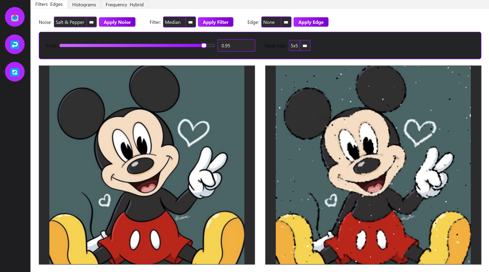
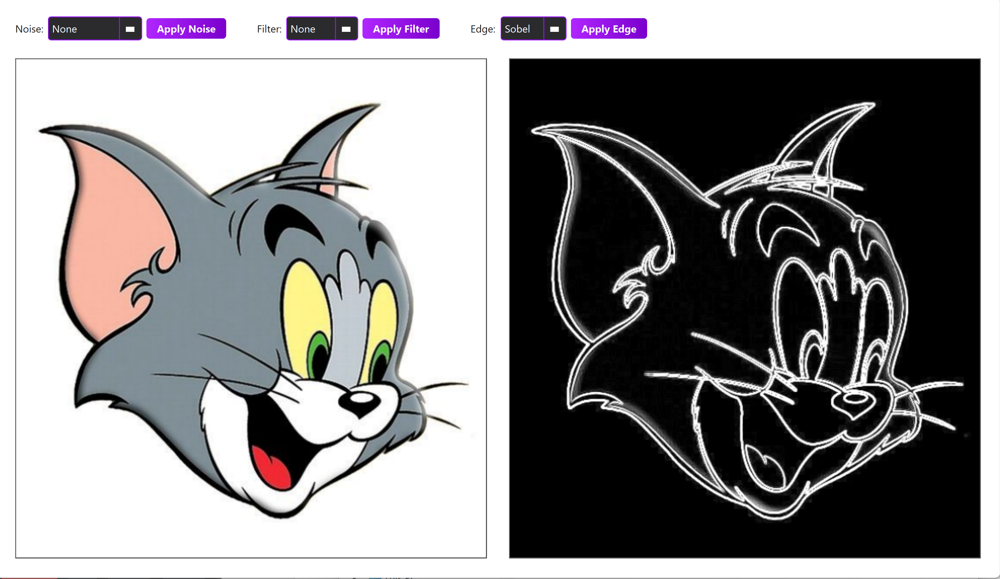
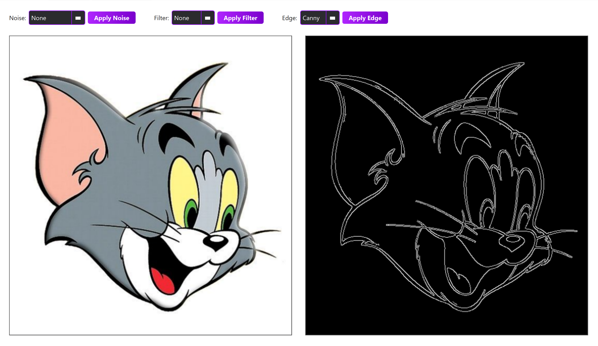
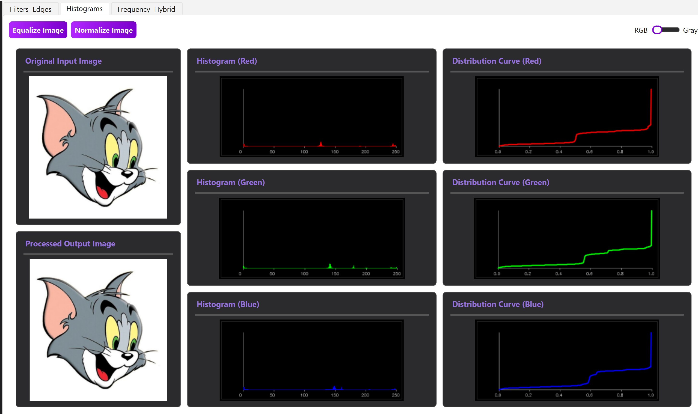
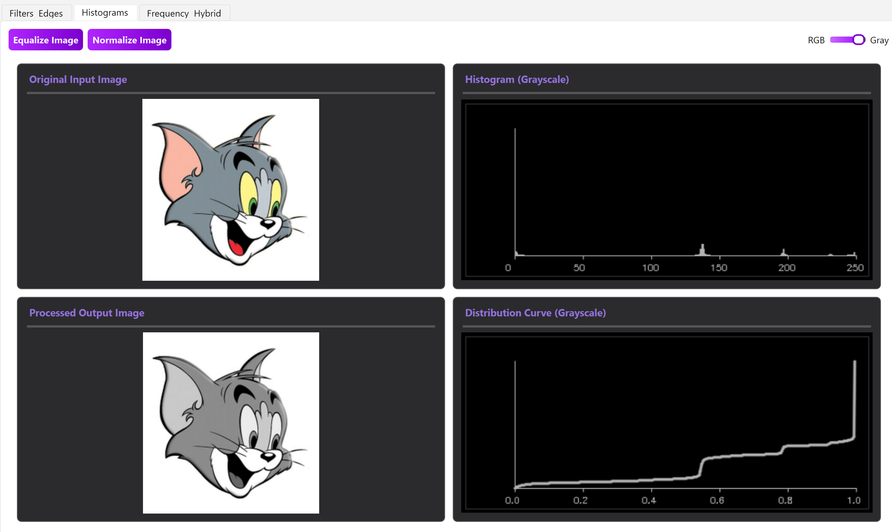
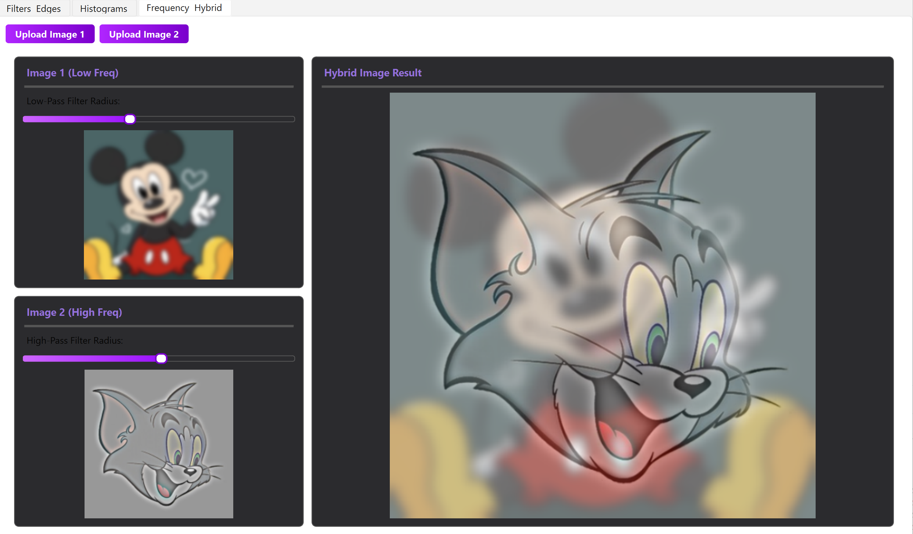

# Image-Processing-Toolbox

# 🎨 Image Processing Toolbox
An interactive **C++/Qt** application for advanced image manipulation, filtering, and frequency analysis. Developed for the **Computer Vision** course (SBME 2027).

---

## 🚀 Features & Task Requirements

### 1. Spatial Domain Processing
* **Noise Generation:** Ability to add various noise models to images.
    * *Models:* Uniform, Gaussian, and Salt & Pepper.
* **Linear & Non-Linear Filtering:**
    * *Low Pass Filters:* Average, Gaussian, and Median filters.
    * *Parameters:* Interactive kernel size selection (3x3, 5x5).
* **Edge Detection:** Gradient-based operators for structural analysis.
    * *Masks:* Sobel, Prewitt, and Roberts (Manual Convolution).
    * *Advanced:* Canny Edge Detector (using OpenCV).
    * *Preview:* Directional gradient visualization (X and Y directions).

### 2. Histograms & Intensity Transformations
* **Image Statistics:** Real-time plotting of Histogram and Distribution (Cumulative) curves for R, G, and B channels independently.
* **Contrast Enhancement:** * **Histogram Equalization:** Global mapping using CDF.
    * **Normalization:** Re-scaling intensity ranges to [0, 255].
* **Color Conversion:** Dynamic transformation from RGB to Grayscale.

### 3. Frequency Domain Analysis
* **Hybrid Images:** Combining the low frequencies of one image with the high frequencies of another to create an optical illusion.
* **Frequency Filters:** Application of High-pass and Low-pass filters in the frequency domain.

---

## 📸 Results Gallery

### 🔹 Noise & Filtering
| Salt & Pepper Noise | Median Filter (Denoised) |
|:---:|:---:|
|  |  |

### 🔹 Edge Detection (Manual vs Canny)
| Sobel Operator | Canny Edge Detector |
|:---:|:---:|
|  |  |

### 🔹 Histogram Analysis
| RGB Histogram & CDF | Gray-scale Transformation |
|:---:|:---:|
|  |  |

### 🔹 Frequency Domain
| Hybrid Result |
|:---:|
|  |

---

## 📂 Project Structure
```text
├── Media/Results/      # Processed output samples for the report
├── src/
│   ├── mainwindow.cpp  # Sidebar logic & filtering algorithms
│   ├── frequencytab.cpp# Frequency domain & Hybrid image logic
│   ├── histogramtab.cpp# Histogram plotting & Equalization
│   └── utils.cpp       # Image display & UI helper functions
└── README.md